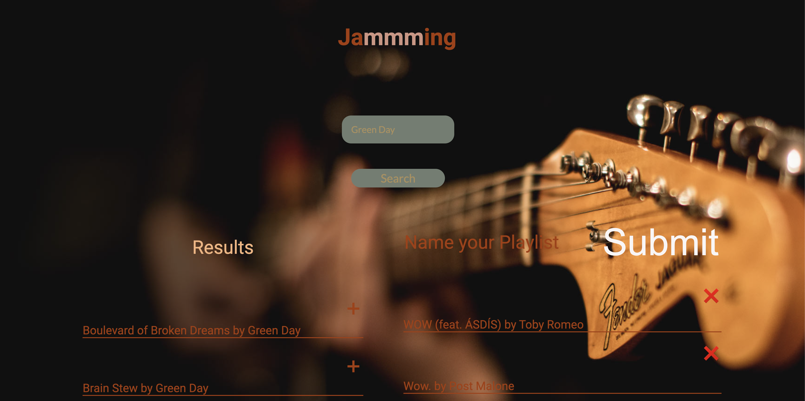

# 🎵 Spotify Playlist Creator 🎶

Welcome to the Spotify Playlist Creator app! 🚀



## About
This project, written in TypeScript using the React library, allows users to seamlessly connect to their Spotify accounts and create custom playlists from their browsers. It leverages the Spotify Web API to provide a smooth and intuitive user experience.

### Features
- **Connect with Spotify:** Log in securely with your Spotify account.
- **Create Custom Playlists:** Mix and match your favorite tracks into personalized playlists.
- **Search and Add:** Easily search for songs and add them to your playlists with a click.
- **Save and Enjoy:** Save your creations directly to Spotify and enjoy them on any device.

### Responsive Design
The app is designed with responsiveness in mind, ensuring a seamless experience across various devices and screen sizes. Whether you're using a desktop, tablet, or smartphone, Spotify Playlist Creator adapts to provide an optimal user interface.

### Accessibility
In addition to its core features, we've integrated accessibility enhancements to ensure the app is usable by everyone. While not a core focus, we've implemented best practices including semantic HTML, ARIA roles, and keyboard navigation support to improve user accessibility.

## Installation
To get started with the Spotify Playlist Creator locally:

1. Clone this repository.
```bash
  git clone https://github.com/your_username/spotify-playlist-creator.git
  cd spotify-playlist-creator
   ```

2. Install dependencies using npm or yarn.
  ```bash
  npm install
  # or
  yarn install
```

3. Input you client_id and client_secret

4. Start the development server.

  ```bash
  npm run dev
  ```

5. Open your browser and navigate to http://localhost:5173

## Contributing
Contributions are welcome! Please feel free to fix the repository and submit pull requests.

## Feedback
We'd love to hear your feedback! Let us know if you have any suggestions or issues by creating a new issue on GitHub.

